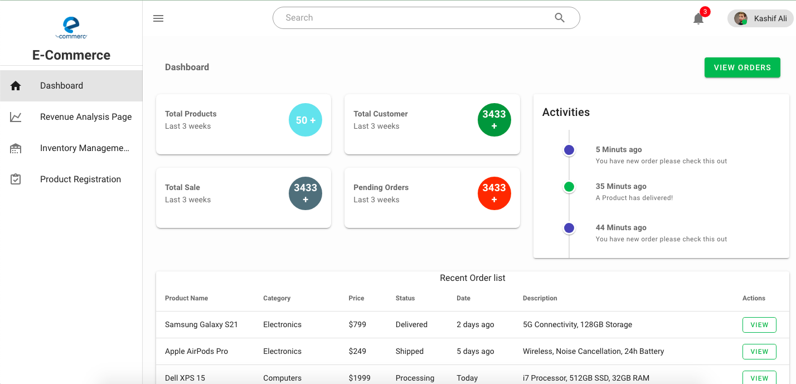

# E-Commerce Admin Dashboard

A comprehensive web-based admin dashboard designed for e-commerce managers to have a holistic understanding of sales, revenue, and inventory status.



## Table of Contents

- [Features](#features)
- [Demo](#demo)
- [Technical Stack](#technical-stack)
- [Setup and Installation](#setup-and-installation)
- [Usage](#usage)
- [Additional Q&amp;A](#additional-q&a)
- [License](#license)

## Features

1. **Revenue Analysis:**

   - Real-time display of total orders and sales.
   - Interactive charts visualizing order, sales, and inventory trends.
   - Revenue data filtering by product categories.
2. **Inventory Management:**

   - List view of all products with their current inventory status.
   - Options to sort, filter, and search products.
   - Functionality to update inventory levels and low inventory alerts.
3. **Product Registration:**

   - Form for adding new products to the inventory.
   - Option to upload product images.


## Demo
You can access the live version of the dashboard here: [E-Commerce Admin Dashboard Demo](https://ecommercedashboardlive.web.app/)

## Technical Stack

- **Frontend:** Vue.js
- **Additional Libraries:** Vuetify (for other features)

## Setup and Installation

1. **Clone the Repository**

   ```bash
   git clone https://github.com/Kashifalirajper/E-CommerceDashboard.git
   cd e-commerce-dashboard
   ```
2. **Install Dependencies**

   ```bash
   npm install
   ```
3. **Run Locally**

   ```bash
   npm run serve
   ```
4. Navigate to `http://localhost:8080` (or the port specified) in your browser.

## Usage

- **Dashboard:** Provides a quick overview of sales, revenue, and inventory status.
- **Revenue Analysis:** Dive deep into the sales trends and forecasts.
- **Inventory Management:** Monitor and update the stock of products.
- **Product Registration:** Easily add new products to the inventory.

## Additional Q&A

- **Essential Libraries:**

  - `vue-router`: For routing and navigation within the dashboard.
  - `chart.js`: To visualize interactive charts for revenue analysis.
- **Optional Libraries:**

  - `vue-upload-component`: Might be necessary for the product image upload feature.
- **Considerations with TypeScript:** Adopting TypeScript can improve code reliability and predictability. Especially for e-commerce admin pages with many columns, TypeScript can help in type-checking and ensuring data consistency.
- **Handling Datetime:** Always store and handle datetime in UTC. Convert to the user's timezone only when displaying. JavaScript's `Date` object and libraries like `moment-timezone` can be handy for these conversions.


## License

MIT License. See `LICENSE` for more information.
